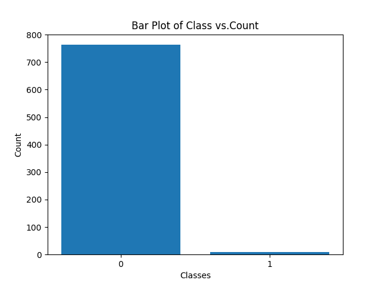
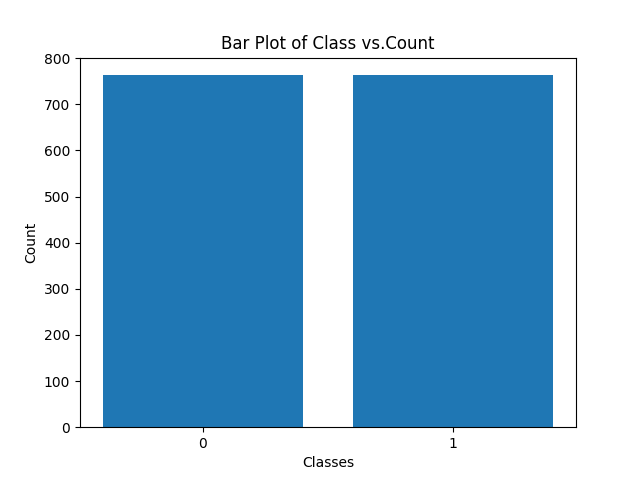

# Sampling-102103072
### Introduction
This assignment deals with the imbalanced dataset and then utilized 5 sampling methods to make 5 samples and compare the performances of 5 ML algorithms on it.
### Dataset 
The dataset is not balanced which can be clearly seen in its graph 
 

### Dealing with imbalanced dataset 
We used Random Over-Sampling With imblearn library to perform over sampling. The over sampling method generate new samples in the minority classes. The most naive strategy is to generate new samples by random sampling with the replacement of the currently available samples. The RandomOverSampler offers such a scheme.
The graph after oversampling dataset :
 
### Sampling Size 
The formula used = $$n = \frac{Z^2 * p * (1-p)}{E^2}$$
Here Z is Z score corresponding to the desired confidence level, p is the estimated proportion with certain characteristic and E is the desired margin of error.
For our case we considered Z=1.96 (95% confidence), p=0.5 and E=0.05, which gave the value of n as 384

### Sampling Methods used 
sample1-> **Simple Random Sampling**: A simple random sample is a randomly selected subset of a population. In this sampling method, each member of the population has an exactly equal chance of being selected.

sample2->**Simple Stratified sampling**: In a stratified sample, researchers divide a population into homogeneous subpopulations called strata (the plural of stratum) based on specific characteristics (e.g., race, gender identity, location, etc.). Every member of the population studied should be in exactly one stratum.Each stratum is then sampled using simple random sampling, allowing researchers to estimate statistical measures for each sub-population.

sample3: **Systematic Sampling**: Systematic sampling is a probability sampling method where researchers select members of the population at a regular interval – for example, by selecting every 15th person on a list of the population. we have chosen k as 3 in our case.

sample4: **BootStrap Sampling**: In statistics, Bootstrap Sampling is a method that involves drawing of sample data repeatedly with replacement from a data source to estimate a population parameter

sample5: **Cross Validation**: Cross validation is a technique used in machine learning to evaluate the performance of a model on unseen data. It involves dividing the available data into multiple folds or subsets, using one of these folds as a validation set, and training the model on the remaining folds. This process is repeated multiple times, each time using a different fold as the validation set. Finally, the results from each validation step are averaged to produce a more robust estimate of the model’s performance. We used 
### Algorithms used 
1) Random Forest
2) XGBoost
3) KNN
4) SVM
5) Logistic Regression

## Results
Output Table 
| Model               | Sample1 | Sample2 | Sample3 | Sample4 | Sample5 |
|---------------------|---------|---------|---------|---------|---------|
| RandomForest        | 0.9914  | 0.9914  | 0.9935  | 0.9828  | 0.9883  |
| XGBoost             | 0.9569  | 0.9828  | 0.9804  | 0.9828  | 0.9844  |
| KNN                 | 0.9483  | 0.8793  | 0.9477  | 0.9828  | 0.9883  |
| SVM                 | 0.6897  | 0.7155  | 0.7124  | 0.9828  | 0.9883  |
| LogisticRegression  | 0.8621  | 0.9310  | 0.8824  | 0.9828  | 0.9819  |

## Final Result
The best Model is Random forest with highest accuracy of 0.9914

 
